# COEUR-Score: Cohesion and Exhaustiveness of User-story Representations

A comprehensive framework for evaluating the quality of user story collections through cohesion and exhaustiveness metrics.

## 📖 Overview

User Stories are key artifacts in Requirement and Software Engineering. Despite their wide adoption, their writing in industrial contexts tend to diverge from the principles initially stated in Agile methodologies. In this context, sets of metrics as INVEST or QUS emerged to qualify these items. In this paper, we argue that the said sets of metrics are only partially efficient at capturing the quality of user stories contextualized in a project, and that their actual adoption in business contexts is limited due to multiples aspects: their unfitness to specific contexts, the difficulty of implementation requiring human intervention, the absence of reproducibility or their misalignment with actual quality of user stories. Consequently, we introduce $\texttt{COEUR}$ a set of two metrics, $\texttt{Cohesion}$ and $\texttt{Exhaustiveness}$ that are automatically computable, quantitative, reproducible, and for which we demonstrate it reflects requirements quality better than State-of-the-Art Metrics through two empirical experiments. Subsequently, $\texttt{COEUR}$ provides a turnkey measurement of Product Backlog's quality for both project monitoring and LLM benchmarking in the context of user stories automatic generation.

$\texttt{COEUR}$ computes as the weighted mean of $\texttt{Exhaustiveness}$ ($\texttt{Exh}$) and $\texttt{Cohesion}$ ($\texttt{Coh}$). $\lambda\in[0, 1]$ is an hyper-parameter allowing to give more importance to either $\texttt{Exh}$ or $\texttt{Coh}$, $\mathcal{R}$ is the reference document (project specifications, requirement document, meeting transcript, etc...), $\mathcal{B}$ refers to the product backlog containing epic, and user stories and $l$ the exhaustiveness depth-level.

$$
\texttt{COEUR}(\mathcal{R},\mathcal{B}, l) = 
    \lambda
    \times
    \texttt{Exh}(\mathcal{R},\mathcal{B}, l) 
+ 
    (1-\lambda) 
    \times 
    \texttt{Coh}(\mathcal{B})
$$

The $\texttt{Exhaustiveness}$ measures topic similarity between $\mathcal{R}$ and $\mathcal{B}$. In project contexts, it is crucial to monitor if the product owner, and other agile team members, write user stories strictly based on the specifications, hence the important of this metric.

$$
\texttt{Exh}(\mathcal{R}, \mathcal{B}, l)
    =
    \begin{cases}
        \sigma(\mathcal{R},\mathcal{B}), \text{for $l=$"$b$"} \\
        \frac{1}{n_\text{epics}}\sum_{i=1}^{n_{\text{epics}}}\sigma(\mathcal{R},e_i), \text{for $l=$"$e$"} \\
        \frac{1}{n_\text{stories}}\sum_{j=1}^{n_{\text{stories}}}\sigma(\mathcal{R},\text{us}_j), \text{for $l=$"s"}
    \end{cases}
$$

$\texttt{Cohesion}$ captures the quality of the backlog breakdown. More specifically, it evaluated semantic proximity of user stories in a given epic and the semantic separation of epic stories. In other words, $\texttt{Cohesion}$ reflects if user stories are in the appropriate epic and if epics are distinct from one another from a semantic perspective. 

$$
\texttt{Coh}(\mathcal{B}) = \psi(y_{\text{epic}}, \phi_\theta(\mathcal{B}))
$$

## 🚀 Features

- **Dual Metrics Approach**: Comprehensive evaluation through both cohesion and exhaustiveness
- **Multiple Clustering Algorithms**: Support for KMeans, Agglomerative, Spectral Clustering
- **Flexible Text Processing**: Configurable preprocessing with stemming, lemmatization, and stopword removal
- **Baseline Comparisons**: Integration with existing metrics (AQUSA, USQA)
- **Visualization Tools**: Interactive plots for analysis and monitoring
- **Multi-Dataset Support**: Evaluation across various real-world datasets

## 🛠️ Installation

### Requirements

- Python 3.8+
- PyTorch
- Transformers
- scikit-learn
- NLTK
- sentence-transformers

### Setup

1. Clone the repository:
```bash
git clone <repository_url>
cd COEUR-Score
```

2. Install dependencies:
```bash
pip install -r requirements.txt
```

3. Download required NLTK and spaCy models:
```python
import nltk
import spacy

# Download NLTK data
nltk.download('averaged_perceptron_tagger_eng')
nltk.download('wordnet')
nltk.download('stopwords')
nltk.download('punkt_tab')

# Download spaCy model
spacy.cli.download("en_core_web_sm")
```

## 📊 Usage

### Basic Usage (Available in `example/coeur_demo.ipynb`)

```python
from coeur.score import Coeur

# Initialize the COEUR Scorer and load data
coeur_scorer = Coeur(random_state=42, lemmatization=True, remove_stopwords=True, stemming=True,
                     remove_re_se_stopwords=True)
R, B = coeur_scorer.load_data(ref_path="datasets/trident/trident_specs.pdf",
                cand_path="datasets/trident/trident_backlog.csv")

# Your user stories as a list of strings
story_level = coeur_scorer.score(R, B, l="s", lmbd=0.5,
                   sigma="auto", psi="auto", phi="auto")

epic_level = coeur_scorer.score(R, B, l="e", lmbd=0.5,
                   sigma="auto", psi="auto", phi="auto")

backlog_level = coeur_scorer.score(R, B, l="b", lmbd=0.5,
                   sigma="auto", psi="auto", phi="auto")

print(f"Story-level COEUR Score: {story_level}")
print(f"Epic-level COEUR Score: {epic_level}")
print(f"Backlog-level COEUR Score: {backlog_level}")
```

### Cohesion Analysis

```python
from coeur.cohesion import CohesionScore, CohesionViz

# Initialize cohesion evaluator
cohesion_eval = CohesionScore()

# Compute cohesion metrics
cohesion_results = cohesion_eval.compute_cohesion(user_stories)

# Visualize clustering results
viz = CohesionViz()
viz.plot_clusters(user_stories, cohesion_results)
```

### Exhaustiveness Analysis

```python
from coeur.exhaustiveness import ExhaustivenessScore, ExhaustivenessViz

# Initialize exhaustiveness evaluator
exhaustiveness_eval = ExhaustivenessScore()

# Compute exhaustiveness metrics
exhaustiveness_results = exhaustiveness_eval.compute_exhaustiveness(user_stories)

# Visualize coverage
viz = ExhaustivenessViz()
viz.plot_coverage(user_stories, exhaustiveness_results)
```

## 📁 Repository Structure

```
COEUR-Score/
├── coeur/                    # Main package
│   ├── cohesion.py                # Cohesion metrics and visualization
│   ├── exhaustiveness.py          # Exhaustiveness metrics and visualization
│   ├── score.py                   # Main COEUR score computation
│   └── baseline/                  # Baseline comparison methods
│       ├── qus/                        # AQUSA quality framework
│       └── usqa/                       # USQA quality assessment
├── datasets/                 # Evaluation datasets
│   ├── alfred/                    # ALFRED project dataset
│   ├── dalpiaz/                   # Dalpiaz et al. dataset
│   ├── neodataset/                # Neo dataset
│   ├── retro/                     # Retro dataset
│   └── trident/                   # Trident dataset
├── experiments/              # Experimental scripts and notebooks
│   ├── metrics_monitoring.ipynb   # Paper results
│   ├── monitor.ipynb              # Individual features analysis
│   ├── plot_incremental_noise.py  # Plotting helpers for incremental noise experiment
│   └── reworked_incremental_noise.py # Incremental noise experiment
└── images/                   # Logos
```

## 🔬 Experiments

The repository includes comprehensive experiments developed in the paper evaluating COEUR against baseline methods:

### Running Experiments

```bash
# Run incremental noise experiments
python experiments/reworked_incremental_noise.py

# Generate visualizations
python experiments/plot_incremental_noise.py
```

### Available Datasets

- **ALFRED**: Real-world user stories from the ALFRED project
- **Dalpiaz**: Curated collection from requirements engineering research
- **NeoDataset**: Large-scale user story collection with various quality levels
- **Retro**: RETRO project user stories dataset
- **Trident**: Duke University project specifications and backlog

## 📈 Baseline Comparisons

COEUR-Score includes implementations of existing user story quality metrics:

- **AQUSA**: Quality assessment based on well-formedness criteria
- **USQA**: User Story Quality Assessment framework

```python
from coeur.baseline.qus.aqusacore import AQUSA
from coeur.baseline.usqa.usqa import USQA

# Compare with baselines
aqusa = AQUSA(user_stories)
aqusa_score = aqusa.compute()

usqa = USQA(user_stories)
usqa_score = usqa.compute()
```

### Retro Dataset - results

##### External Noising Experiment
<div style="display: flex; justify-content: space-between;">
  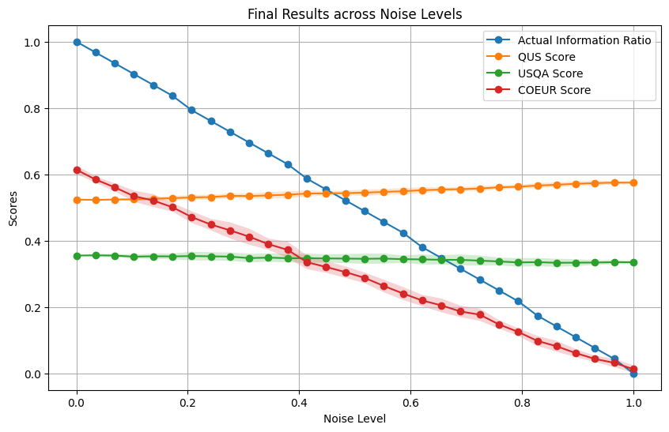
  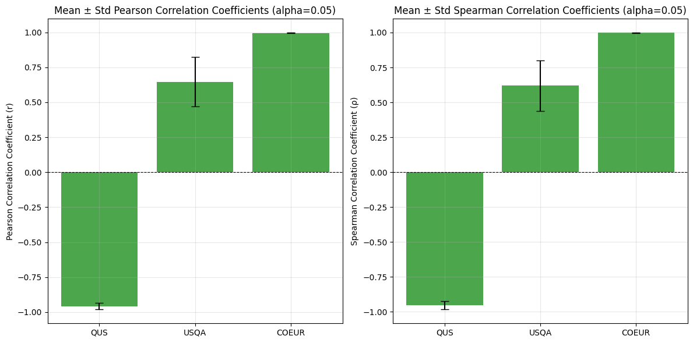
</div>

##### External Noising Experiment
<div style="display: flex; justify-content: space-between;">
  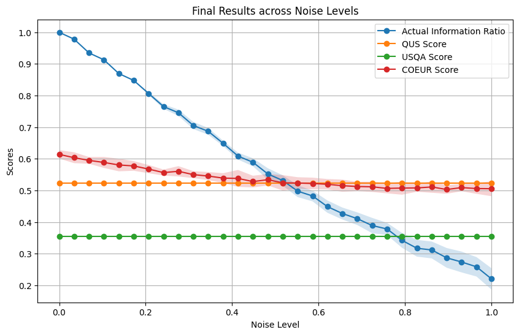
  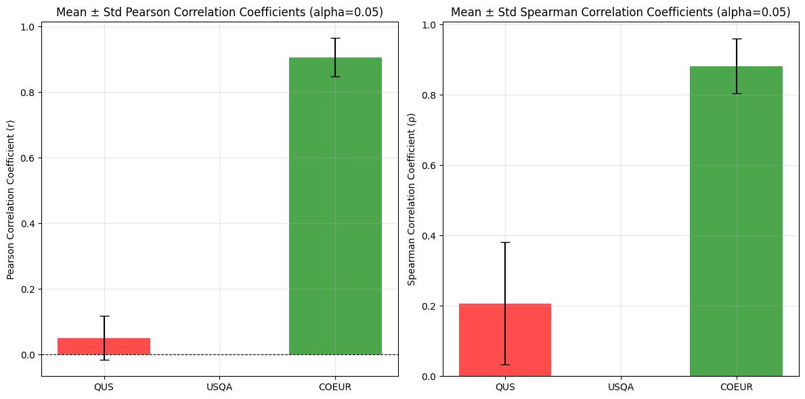
</div>

### Trident Dataset - results

##### External Noising Experiment
<div style="display: flex; justify-content: space-between;">
  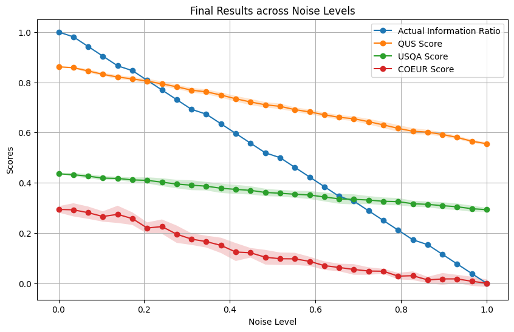
  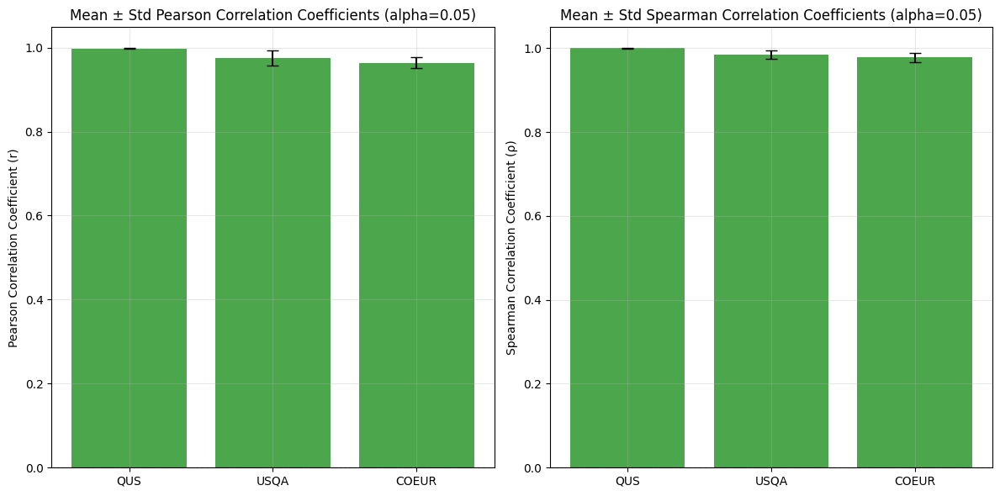
</div>

##### External Noising Experiment
<div style="display: flex; justify-content: space-between;">
  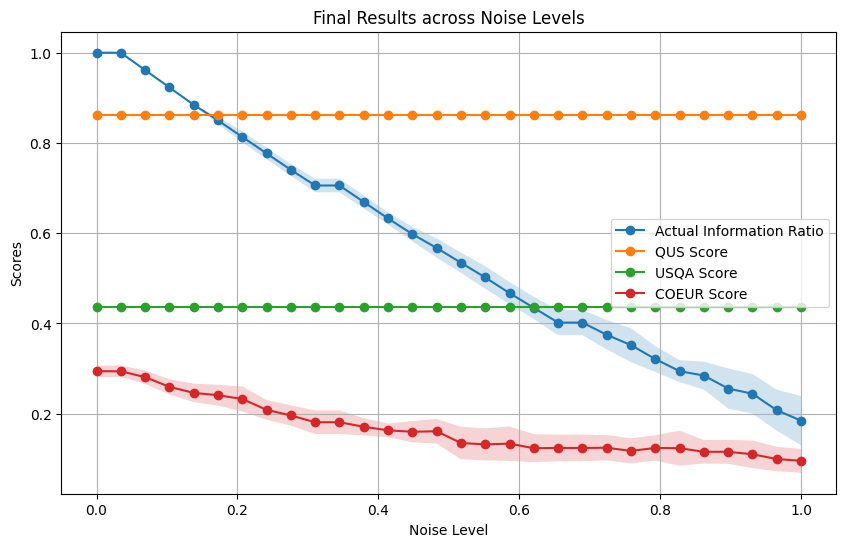
  
</div>

### Alfred Dataset - results

##### External Noising Experiment
<div style="display: flex; justify-content: space-between;">
  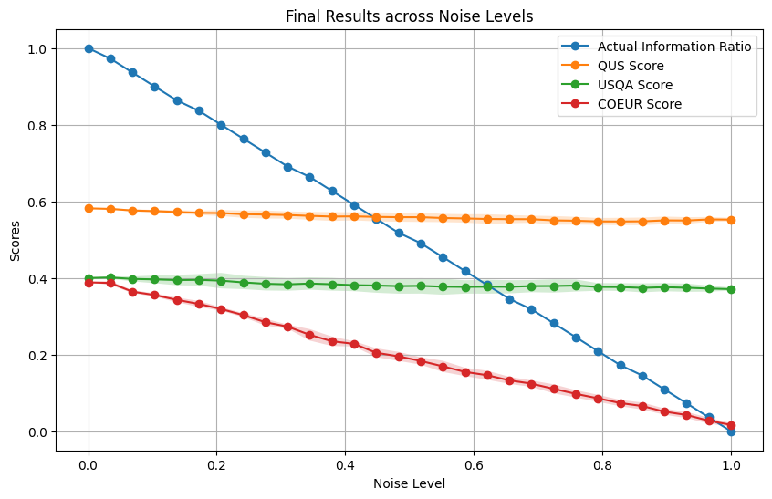
  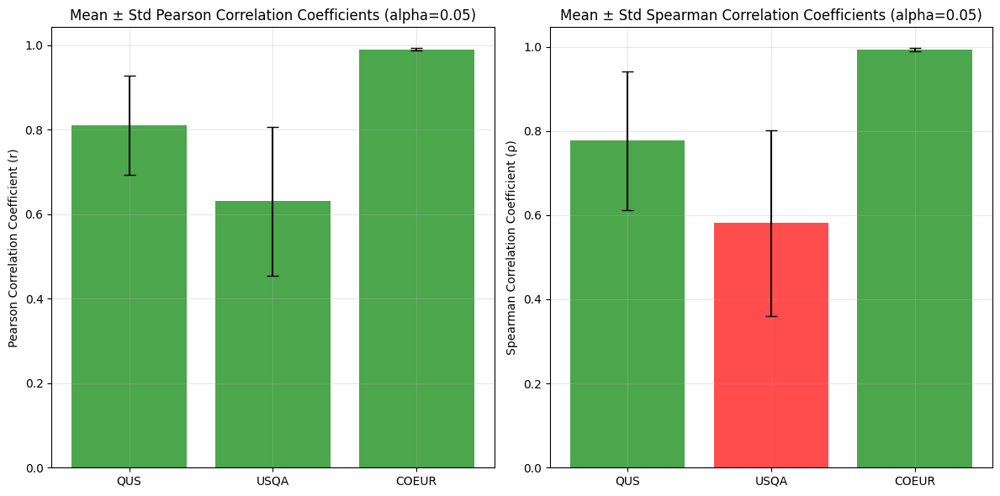
</div>

##### External Noising Experiment
<div style="display: flex; justify-content: space-between;">
  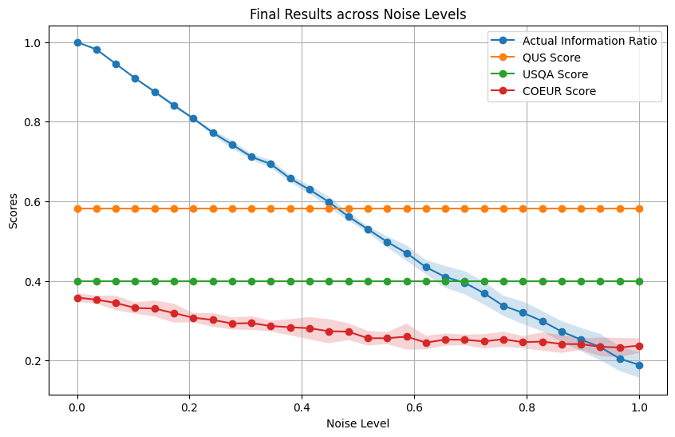
  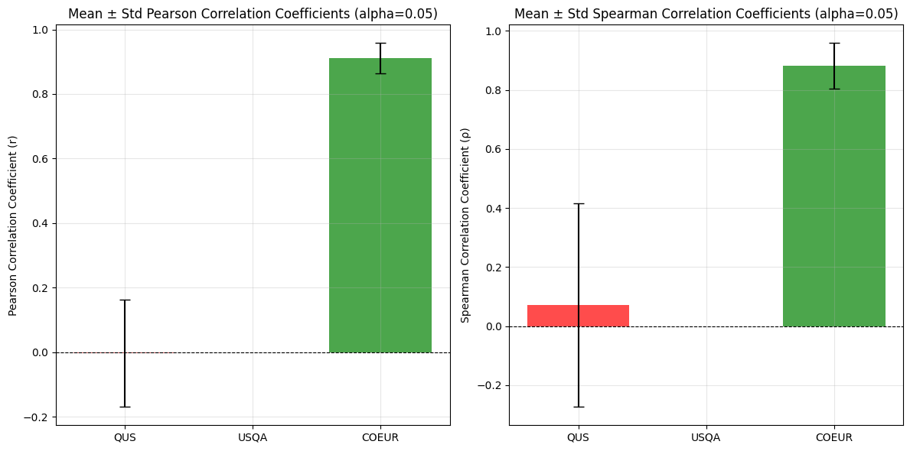
</div>