# COEUR-Score: Cohesion and Exhaustiveness of User-story Representations

A comprehensive framework for evaluating the quality of user story collections through cohesion and exhaustiveness metrics.

## 📖 Overview

User Stories are key artifacts in Requirement and Software Engineering. Despite their wide adoption, their writing in industrial contexts tends to diverge from the principles initially stated in Agile methodologies. In this context, sets of metrics such as INVEST or QUS emerged to qualify these items. In this paper, we argue that the said sets of metrics are only partially efficient at capturing the quality of user stories contextualized in a project, and that their actual adoption in business contexts is limited due to multiple aspects: their unfitness to specific contexts, the difficulty of implementation requiring human intervention, the absence of reproducibility or their misalignment with actual quality of user stories. Consequently, we introduce $\texttt{COEUR}$ a set of two metrics, $\texttt{Cohesion}$ and $\texttt{Exhaustiveness}$ that are automatically computable, quantitative, reproducible, and for which we demonstrate it reflects requirements quality better than State-of-the-Art metrics through two empirical experiments. Subsequently, $\texttt{COEUR}$ provides a turnkey measurement of Product Backlog's quality for both project monitoring and LLM benchmarking in the context of user stories automatic generation.

$\texttt{COEUR}$ which computes as the weighted mean of $\texttt{Exhaustiveness}$ and $\texttt{Cohesion}$. $\lambda\in[0, 1]$ is an hyper-parameter allowing to give more importance to either $\texttt{Exh}$ or $\texttt{Coh}$, $\mathcal{R}$ is the reference document (project specifications, requirement document, meeting transcript, etc...), $\mathcal{B}$ refers to the product backlog containing epic, and user stories and $l$ the exhaustiveness depth-level.

$$
\texttt{COEUR}(\mathcal{R},\mathcal{B}, l) = 
    \lambda
    \times
    \texttt{Exh}(\mathcal{R},\mathcal{B}, l) 
+ 
    (1-\lambda) 
    \times 
    \texttt{Coh}(\mathcal{B})
$$

The $\texttt{Exhaustiveness}$ measures topic similarity between $\mathcal{R}$ and $\mathcal{B}$. In applied software engineering scenarios, it is crucial to monitor if the Product Owner, and other agile team members, write user stories strictly based on the specifications, hence the important of this metric. The depth level $l$, allows to compute similarity score at different scales of the backlog: $l=\text{"b"}$ for backlog-level where $\mathcal{B}$ is compare at once with $\mathcal{R}$, $l=\text{"e"}$ for epic-level where each epic $e_i$ is compared individual with $\mathcal{R}$ and $l=\text{"s"}$ for story-level where each user story $s_j$ is compared to $\mathcal{R}$. Finally, $\sigma$ the similarity can be any NLP metric comparing two natural language texts such as ROUGE, BLEU or Bertscore.

$$
\texttt{Exh}(\mathcal{R}, \mathcal{B}, l)
    =
    \begin{cases}
        \sigma(\mathcal{R},\mathcal{B}), \text{for $l=$"$b$"} \\
        \frac{1}{n_\text{epics}}\sum_{i=1}^{n_{\text{epics}}}\sigma(\mathcal{R},e_i), \text{for $l=$"$e$"} \\
        \frac{1}{n_\text{stories}}\sum_{j=1}^{n_{\text{stories}}}\sigma(\mathcal{R},\text{us}_j), \text{for $l=$"s"}
    \end{cases}
$$

$\texttt{Cohesion}$ captures the quality of the backlog breakdown. More specifically, it evaluated semantic proximity of user stories in a given epic and the semantic separation of epic stories. In other words, $\texttt{Cohesion}$ reflects if user stories are in the appropriate epic and if epics are distinct from one another from a semantic perspective. The goal is to compare clustering labels $\hat y_\text{epic} = \phi_\theta(\mathcal{B})$ produced by a clustering algorithm $\phi_\theta$ and the actual epic label $y_{\text{epic}}$. If the two sets of labels $\hat y_\text{epic}$ and $y_{\text{epic}}$ are similar relative to a permutation-invariant metric $\psi$ such as Rand-Index or Mutual Information, it tells us that the epic story assigned to each user story by a Product Owner (or a LLM) are are similarly organized on the semantic level. Thus, epic stories are semantically distinct (otherwise $\phi_\theta$ cannot infer clusters) and user stories are correctly assigned to epic stories.

$$
\texttt{Coh}(\mathcal{B}) = \frac{\psi(y_{\text{epic}}, \phi_\theta(\mathcal{B})) \times \rho}{\psi(y_{\text{epic}}, \phi_\theta(\mathcal{B})) + \rho}
$$

> [!NOTE]
> The penalization of the cohesion is updated compared to the original paper as it yields better overall results. $\rho$ corresponds to the Type-Token Ratio (TTR) of the subset of user stories in the backlog $\mathcal{B}$.

$$
\rho(\mathcal{B}) = \frac{|\text{unique}\_\text{tokens}(\mathcal{B})|}{|\text{total}\_\text{tokens}(\mathcal{B})|}
$$

## 🚀 Features

- **Dual Metrics Approach**: Comprehensive evaluation through both cohesion and exhaustiveness
- **Multiple Clustering Algorithms**: Support for KMeans, Agglomerative, Spectral Clustering
- **Flexible Text Processing**: Configurable preprocessing with stemming, lemmatization, and stopword removal
- **Baseline Comparisons**: Integration with existing metrics (AQUSA, USQA)
- **Visualization Tools**: Interactive plots for analysis and monitoring
- **Multi-Dataset Support**: Evaluation across various real-world datasets

## 🗂️ Easy Installation (Docker)

For reviewers, the repository ships a self-contained, GPU-enabled Docker image.
It pins the exact dependency versions, pre-downloads every model and NLP corpus,
and launches Jupyter Lab so the demo and experiments run out of the box.

> The code automatically falls back to CPU when no GPU is available, so the
> image runs on any host. A GPU only speeds things up.

### Prerequisites

- [Docker](https://docs.docker.com/get-docker/) (with Docker Compose v2).
- **For GPU acceleration only:** an NVIDIA GPU, recent driver, and the
  [NVIDIA Container Toolkit](https://docs.nvidia.com/datacenter/cloud-native/container-toolkit/latest/install-guide.html).

### Build & run

> [!NOTE]
> The Docker image is available on [Zenodo](https://zenodo.org/records/20641209) and is ~17 GB in size as it includes all LLM models and datasets used in the paper. Skip the build step below if you use the pre-built image.

```bash
# Build the image (downloads models at build time; this step is large).
docker build -t coeur-score . # don't do if you use our pre-built image

# Run with GPU access...
docker run --rm --gpus all -p 8888:8888 coeur-score

# ...or on a CPU-only host (drop --gpus all):
docker run --rm -p 8888:8888 coeur-score
```

Then open the `http://127.0.0.1:8888/lab?token=...` URL printed in the logs and
run `example/coeur_demo.ipynb` (or connect via VSCode).

### Reproduction scope

- **Core metrics, baselines (AQUSA/USQA) and noise-based experiments** run fully
  offline inside the container.
- **LLM-based generation experiments** (`experiments/llm_based/icl*.ipynb`,
  `sft.ipynb`) additionally require external resources — an Azure OpenAI
  deployment and/or a reachable Ollama server, and a GPU for fine-tuning. Copy
  `.env.example` to `.env` and fill in the credentials, then pass it to the
  container (Docker Compose loads it automatically, or use
  `docker run --env-file .env ...`).

## 🛠️ Manual Installation

### Requirements

- Python 3.12
- PyTorch
- Transformers
- scikit-learn
- NLTK
- sentence-transformers

### Setup

1. Clone the repository:
```bash
git clone <repository_url>
cd COEUR-Score
```

2. Install dependencies:
```bash
pip install -r requirements.txt
```

3. Download required NLTK and spaCy models:
```python
import nltk
import spacy

# Download NLTK data
nltk.download('averaged_perceptron_tagger_eng')
nltk.download('wordnet')
nltk.download('stopwords')
nltk.download('punkt_tab')

# Download spaCy model
spacy.cli.download("en_core_web_sm")
```

## 🏁 Getting Started (30 minutes Guide)

The quickest way to try `COEUR` is to run the demo notebook
[`example/coeur_demo.ipynb`](example/coeur_demo.ipynb). It loads a reference
document and a backlog, then computes the `COEUR` score at the story, epic and
backlog levels.

### 1. Launch Jupyter

- **With Docker:** open the `http://127.0.0.1:8888/lab?token=...` URL printed by
  `docker run ... coeur-score` (see [Easy Installation (Docker)](#️-easy-installation-docker)).
- **With VSCode:** Get VSCode Docker extension and attach to the Docker container and open the notebook in VS Code.
- **With a manual install:** from the repository root, start Jupyter and open the
  notebook:

  ```bash
  jupyter lab   # or: jupyter notebook
  ```

### 2. Run `example/coeur_demo.ipynb`

Execute every cell from top to bottom. The notebook walks through the core API:

```python
from coeur.score import Coeur

# Initialize the COEUR scorer and load the data
coeur_scorer = Coeur(random_state=42, lemmatization=True, remove_stopwords=True,
                     stemming=True, remove_re_se_stopwords=True)
R, B = coeur_scorer.load_data(ref_path="datasets/trident/trident_specs.pdf",
                              cand_path="datasets/trident/trident_backlog.csv")

# Compute COEUR at the story, epic and backlog levels
story_level   = coeur_scorer.score(R, B, l="s", lmbd=0.5, sigma="auto", psi="auto", phi="auto")
epic_level    = coeur_scorer.score(R, B, l="e", lmbd=0.5, sigma="auto", psi="auto", phi="auto")
backlog_level = coeur_scorer.score(R, B, l="b", lmbd=0.5, sigma="auto", psi="auto", phi="auto")

print(f"Story-level   COEUR Score: {story_level}")
print(f"Epic-level    COEUR Score: {epic_level}")
print(f"Backlog-level COEUR Score: {backlog_level}")
```

That's it — you now have a working `COEUR` setup. To reproduce the paper's
experiments, continue with the [step-by-step guide](#-step-by-step-experiments).

## 🔬 Step-by-Step Experiments

The paper backs `COEUR` with two empirical experiments, both reproducible from
this repository. Run every command and notebook from the **repository root** so
that the relative dataset paths resolve correctly.

| Experiment | Hardware | External services |
| --- | --- | --- |
| Noise-based | CPU (GPU optional) | None — runs fully offline |
| LLM-based | GPU recommended (required for fine-tuning) | Azure OpenAI and/or Ollama for ICL |

### Noise-based experiments

> [!WARNING]
> With the default paper settings these runs are computationally intensive and
> may take several hours. To iterate faster, lower `N_SEEDS` and
> `N_NOISE_LEVELS`, or restrict `DATASET_NAME` to a single dataset at the top of
> the script. No GPU required.

1. **Run the experiment.** Execute the incremental-noise script. It saves one
   JSON result file per run under `experiments/noise_based/<dataset>/`:

   ```bash
   python experiments/reworked_incremental_noise.py
   ```

   The hyperparameters (`DATASET_NAME`, `N_SEEDS`, `N_NOISE_LEVELS`, included
   baselines, etc.) are defined at the top of
   [`experiments/reworked_incremental_noise.py`](experiments/reworked_incremental_noise.py)
   and can be edited before running.

2. **Visualize the results.** Run the monitoring notebooks to regenerate the
   paper figures:
   - [`experiments/noise_based/metrics_monitoring.ipynb`](experiments/noise_based/metrics_monitoring.ipynb)
     — metric-level results reported in the paper.
   - [`experiments/noise_based/features_monitoring.ipynb`](experiments/noise_based/features_monitoring.ipynb)
     — individual feature analysis.

### LLM-based experiments

> [!WARNING]
> These experiments require external resources, and a GPU is recommended for LLM
> inference (and required for fine-tuning).

**Prerequisite — configure credentials.** Copy the template and fill in the
values for your Azure OpenAI deployment and/or Ollama server:

> [!NOTE]
> You only need to setup the `.env` file if you want to run `icl_generate_strategies-step1.ipynb` which creates raw strategies for the ICL experiment. The notebook `icl_viz_strategies-step2.ipynb` can be run without any credentials and is already wired to the strategies used for the paper's results.


```bash
cp .env.example .env
# then edit .env
```

With Docker, the variables are loaded automatically by Docker Compose, or pass
them with `docker run --env-file .env ...`.

#### In-Context Learning (ICL)

1. **Step 1 — generate.** Run
   [`experiments/llm_based/icl_generate_strategies-step1.ipynb`](experiments/llm_based/icl_generate_strategies-step1.ipynb).
   Pick the backend in the LLM cell (`AzureChatOpenAI` or `ChatOllama`). The
   notebook generates user stories under the four ICL strategies (context +
   related stories, neither, context-only, epic-only) and writes the outputs to
   `experiments/llm_based/output/`.

2. **Step 2 — visualize.** Run
   [`experiments/llm_based/icl_viz_strategies-step2.ipynb`](experiments/llm_based/icl_viz_strategies-step2.ipynb)
   to compare the strategies and produce the paper figures. It can be run on its
   own using the pre-computed outputs from step 1.

#### Supervised Fine-Tuning (SFT)

Run [`experiments/llm_based/sft.ipynb`](experiments/llm_based/sft.ipynb) to
fine-tune and evaluate a model. Select the base model by setting the `model_id`
variable (e.g. `"HuggingFaceTB/SmolLM2-135M"`). A GPU is required.

## 📁 Repository Structure

```
COEUR-Score/
├── coeur/                    # Main package
│   ├── cohesion.py                # Cohesion metrics and visualization
│   ├── exhaustiveness.py          # Exhaustiveness metrics and visualization
│   ├── score.py                   # Main COEUR score computation
│   └── baseline/                  # Baseline comparison methods
│       ├── qus/                        # AQUSA quality framework
│       └── usqa/                       # USQA quality assessment
├── datasets/                 # Evaluation datasets
│   ├── alfred/                    # ALFRED project dataset
│   ├── dalpiaz/                   # Dalpiaz et al. dataset
│   ├── neodataset/                # Neo dataset
│   ├── retro/                     # Retro dataset
│   └── trident/                   # Trident dataset
├── experiments/              # Experimental scripts and notebooks
│   ├── reworked_incremental_noise.py  # Noise-based experiment script
│   ├── llm_based/                 # LLM-based user story generation experiments
│   │   ├── icl_generate_strategies-step1.ipynb  # ICL — step 1: generate
│   │   ├── icl_viz_strategies-step2.ipynb       # ICL — step 2: visualize
│   │   └── sft.ipynb                            # Supervised fine-tuning experiment
│   └── noise_based/               # Noise-based experiments and outputs
│       ├── metrics_monitoring.ipynb   # Paper metric results
│       └── features_monitoring.ipynb  # Individual feature analysis
└── images/                   # Logos
```

### Available Datasets

- **ALFRED**: Real-world user stories from the ALFRED project
- **Dalpiaz**: Curated collection from requirements engineering research
- **NeoDataset**: Large-scale user story collection with various quality levels
- **Retro**: RETRO project user stories dataset
- **Trident**: Duke University project specifications and backlog

## 📈 Baseline Comparisons

COEUR-Score includes implementations of existing user story quality metrics:

- **AQUSA**: Quality assessment based on well-formedness criteria
- **USQA**: User Story Quality Assessment framework

```python
from coeur.baseline.qus.aqusacore import AQUSA
from coeur.baseline.usqa.usqa import USQA

user_stories = ... # List of str

# Compare with baselines
aqusa = AQUSA(user_stories)
aqusa_score = aqusa.compute()

usqa = USQA(user_stories)
usqa_score = usqa.compute()
```

## Additional Results for Noise-based Experiments

### Retro Dataset - results

##### External Noising Experiment
<div style="display: flex; justify-content: space-between;">
  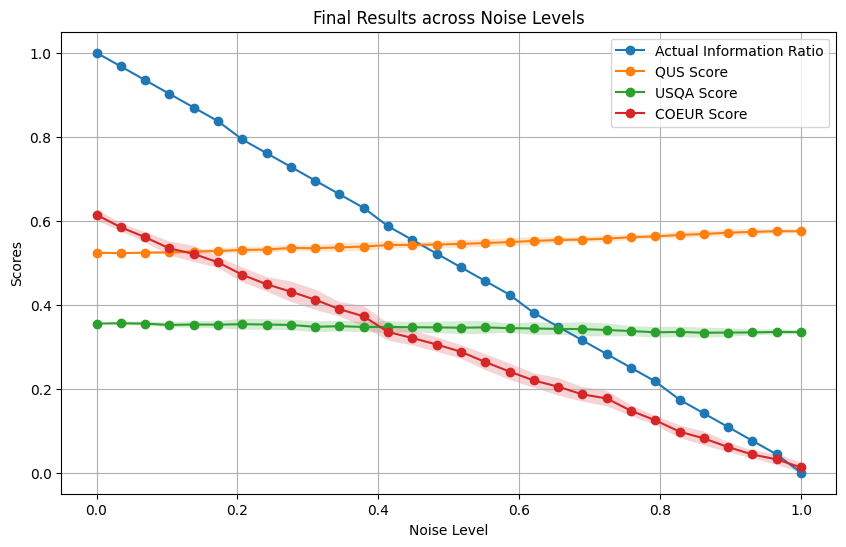
  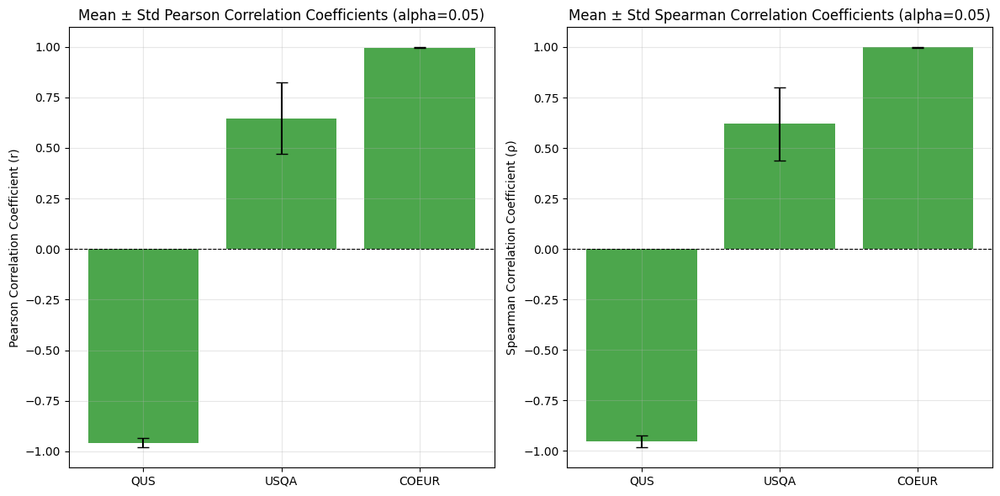
</div>

##### External Noising Experiment
<div style="display: flex; justify-content: space-between;">
  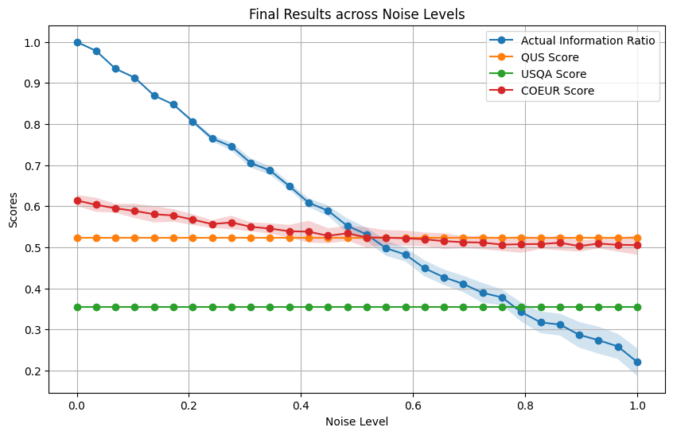
  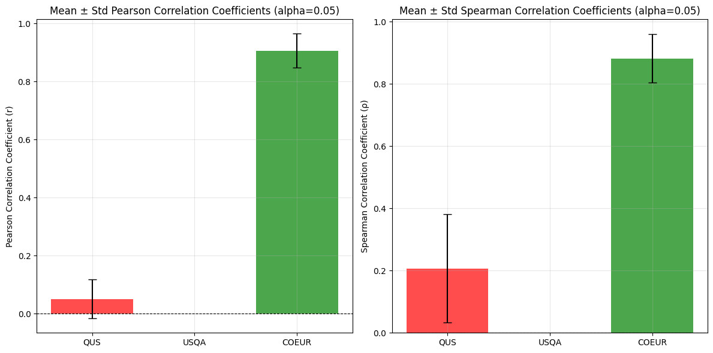
</div>

### Trident Dataset - results

##### External Noising Experiment
<div style="display: flex; justify-content: space-between;">
  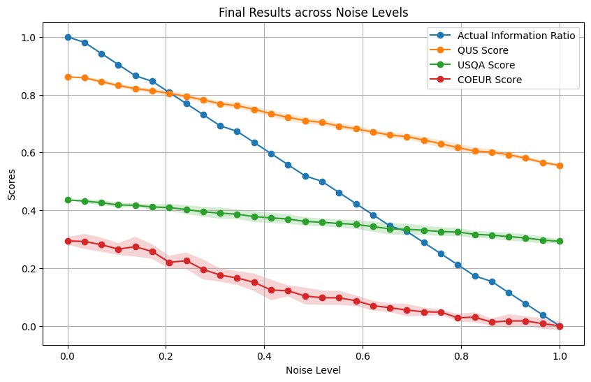
  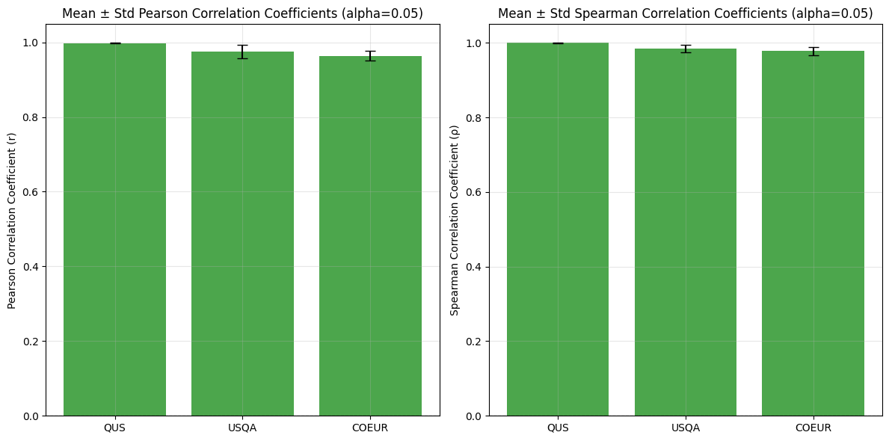
</div>

##### External Noising Experiment
<div style="display: flex; justify-content: space-between;">
  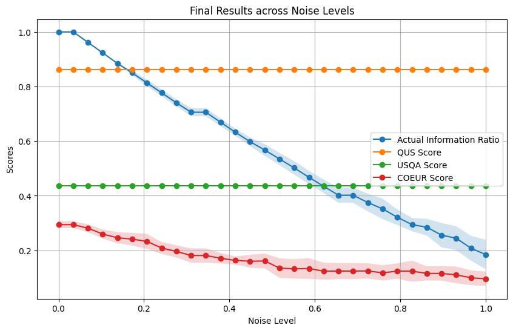
  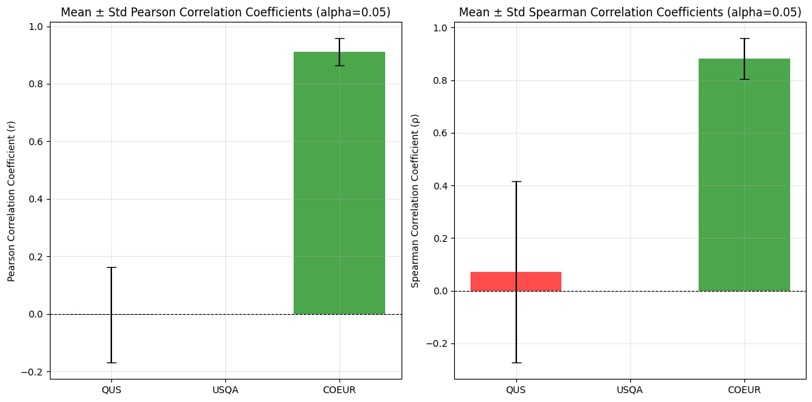
</div>

### Alfred Dataset - results

##### External Noising Experiment
<div style="display: flex; justify-content: space-between;">
  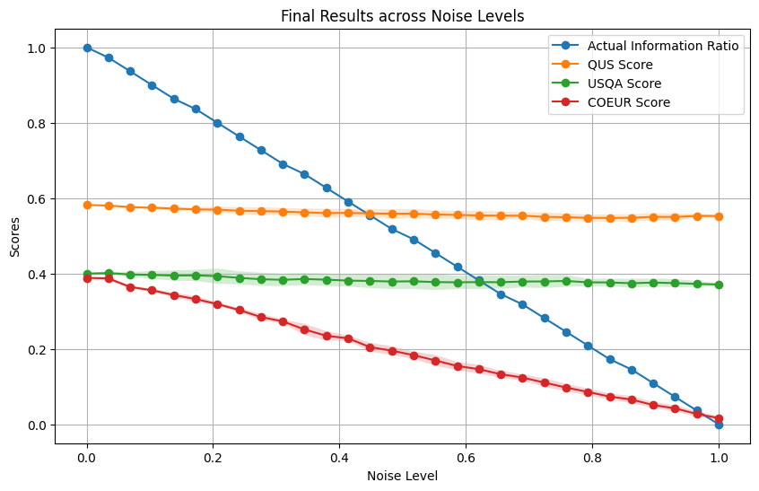
  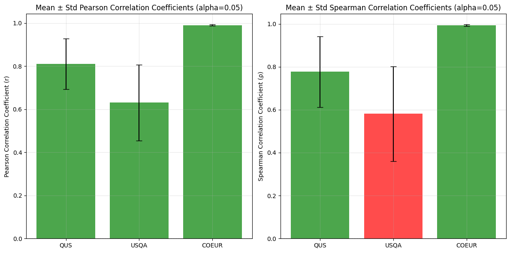
</div>

##### External Noising Experiment
<div style="display: flex; justify-content: space-between;">
  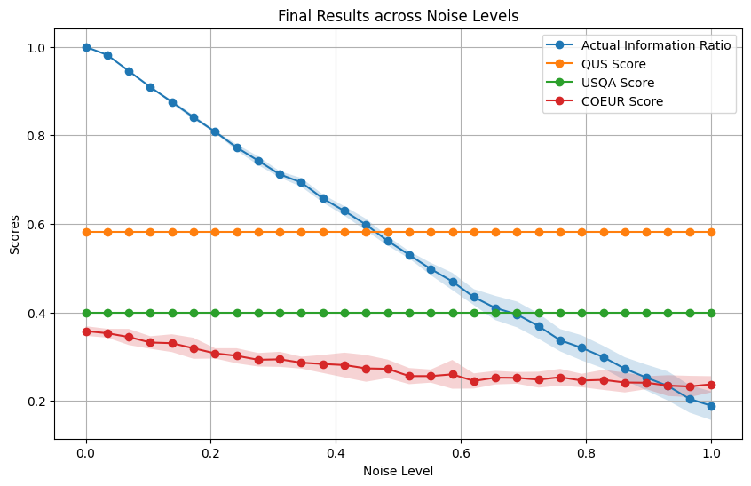
  
</div>

## Additional Results for LLM-based Experiments

### GPT-4.1-mini Results

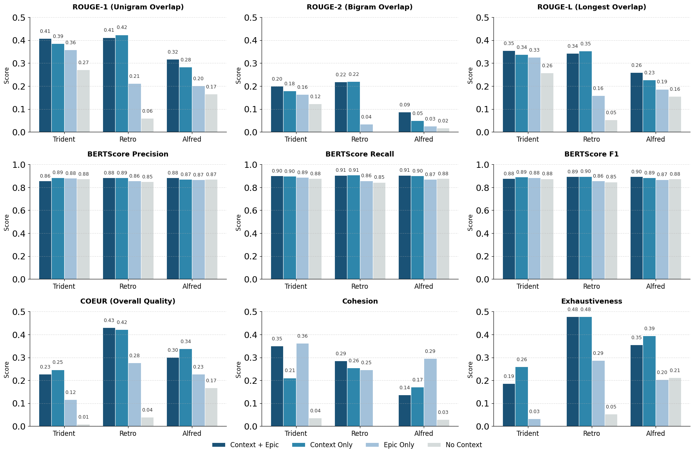

### Mistral-Small-22b Results

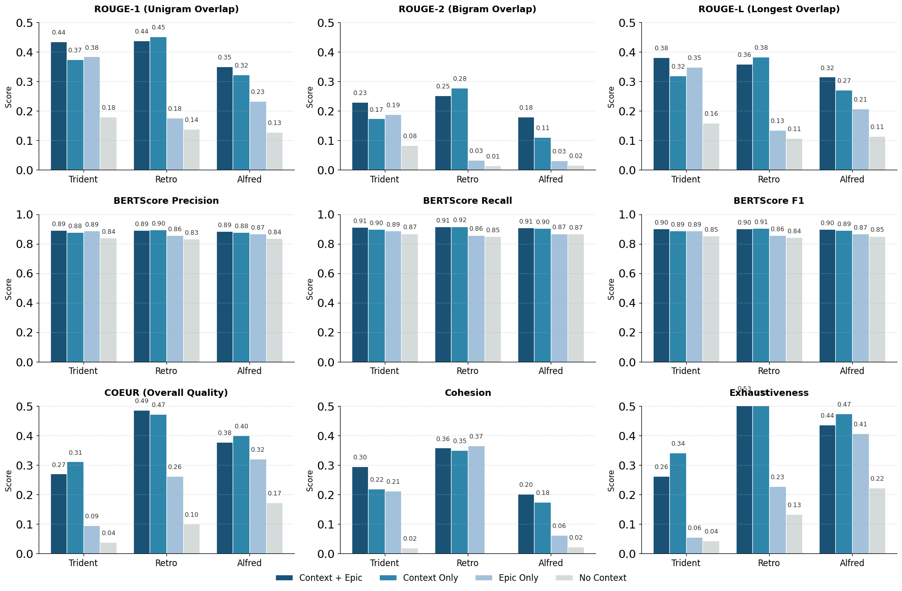